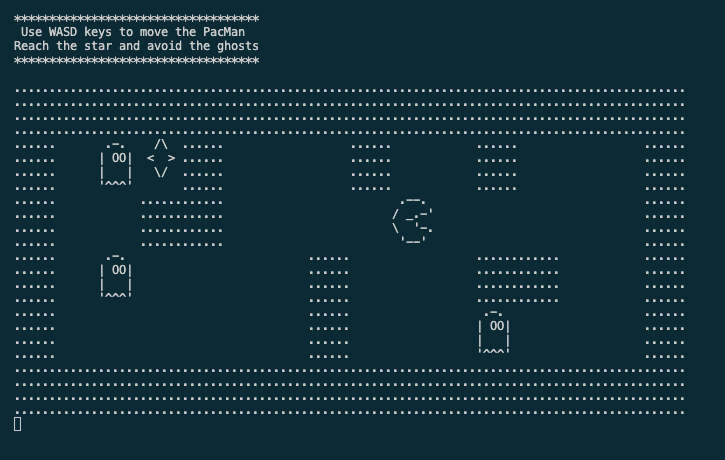

# C-Man: A Pac-Man-inspired game in C

A simple Pac-Man-like text-based game written in C. Move the character using the WASD keys to collect the treasure and avoid ghosts that move randomly on the map.



## Table of Contents

- [Features](#features)
- [Project Highlights](#project-highlights)
- [How to Play](#how-to-play)
- [Getting Started](#getting-started)
    - [Installation](#installation)
    - [Contributing](#contributing)
- [Known Issues](#known-issues)
- [Acknowledgments](#acknowledgments)
- [License](#license)

## Features

- Text-based game with simple controls.
- Randomized ghost movement for a challenge.
- Win the game by collecting the treasure.
- Lose the game if a ghost catches you.
- Possibility to personalize the map without changing code.

## Project Highlights

- **Custom Data Structures**: The game leverages custom data structures, such as structs, to manage game elements like the map and actors.
- **File Handling**: The project employs file handling to read and load the game map from an external file.
- **Dynamic Memory Allocation**: Memory is dynamically allocated for the map, providing efficient management.
- **In-Game Logic**: The game implements logic for actor movement, collision detection, and simple AI behavior.
- **Error Handling**: Error handling is included, making use of standard error codes and messages for debugging.
- **ASCII Art**: ASCII Art handled in arrays in order to make the game more visually appealing.

## Getting Started

### How to Play

1. Use the WASD keys and press ENTER to move the C-Man around the map.
2. Collect the treasure to win.
3. Avoid ghosts, as touching them results in losing the game.

### Installation

You'll need a C compiler (e.g., GCC) to compile the game.

1. Clone the repository:

   ```sh
   git clone https://github.com/anacletu/pac-man-c.git
   ```
2. Compile the game:

   ```sh
   gcc map.c actor.c main.c -o c-man
   ```
3. Run the game:

   ```sh
   ./c-man
   ```

## Contributing

Contributions are welcome! If you'd like to improve the game or fix any issues, please follow these steps:

1. Fork the repository.
2. Create a new branch for your feature or bug fix.
3. Make your changes and commit them.
4. Push your changes to your fork.
5. Create a pull request.

## Known Issues

1. Occasionally, the ghosts jump more than one space.
2. Occasionally, the pacman disappears, although the game still responds as expected.

## Acknowledgments

- [Map and characters ASCII Art from Maurício Aniche](https://github.com/mauricioaniche).

## License

This project is open-source and available under the [MIT License](LICENSE).